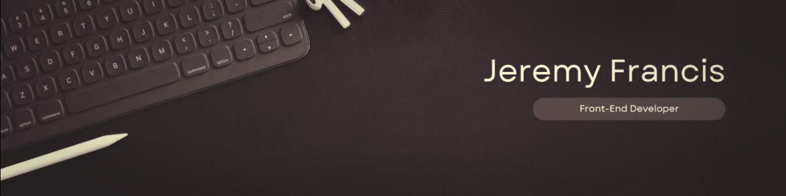

I believe in creating seamless and intuitive user experiences with modern web technologies. Join me on my journey through web development!

🌟 [Check out my portfolio](https://jeremydfrancis.dev)
🔥 [Explore my GitHub projects](https://github.com/Jeremydfrancis)
🎓 [Connect with me on LinkedIn](https://www.linkedin.com/in/jeremy-francis-022499279/)

## Achievements

- **Advanced React** – Meta, July 2024
- **Responsive Web Design** – freeCodeCamp, February 2024
- **Figma UI/UX Design Essentials** – Udemy, February 2024
- **React Basics** – Meta, October 2023
- **HTML and CSS in Depth** – Meta, September 2023
- **Programming with JavaScript** – Meta, September 2023
- **Version Control** – Meta, September 2023
- **Introduction to Front-End Development** – Meta, August 2023

Let's build something amazing together!  
📫 Reach out: [jeremydfrancis0@gmail.com](mailto:jeremydfrancis0@gmail.com)
